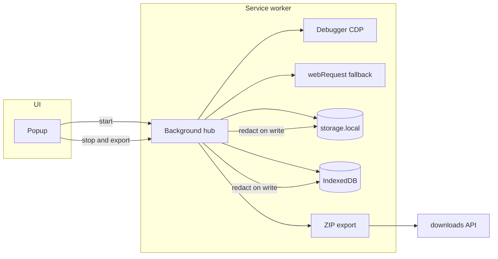

Manual browser triage is slow and inconsistent. Someone reports a bug, you ask for screenshots, they paste a console snippet, you ask for network requests, they forget a header, you schedule a screen share. The repro bundle is incomplete before engineering even opens a ticket.

I built a Chrome extension to replace that loop: start a session, browse normally, stop and export a local ZIP with network logs, console output, browser metadata, and an offline HTML report. No upload. No telemetry. Consent required before capture starts.

This post covers the architecture, the MV3 constraints that shaped it, and the tradeoffs I would make again.

## The problem

Support and engineering workflows need the same artifacts DevTools exposes — but non-engineers should not have to use DevTools, and engineers should not have to reconstruct state from partial screenshots.

A good capture bundle includes:

- Network requests with timing and status (HAR-style)
- Console messages with stack traces
- Page URL, user agent, viewport, and extension version
- Optional screen recording when visual context matters

The hard part is not collecting data. It is collecting **enough** data while **defaulting to privacy** and surviving Manifest V3's service worker model.

## MV3 constraints that matter

Manifest V3 removed persistent background pages. The extension runs in a **service worker** that Chrome can kill at any time. That affects everything:

| Constraint                    | Impact                                                                           |
| ----------------------------- | -------------------------------------------------------------------------------- |
| No persistent background page | Session state must survive SW restarts                                           |
| `chrome.debugger` API         | Attaching shows Chrome's debugging banner on the tab                             |
| Storage quotas                | Large network logs need IndexedDB with eviction, not only `chrome.storage.local` |
| No arbitrary remote upload    | Export via `chrome.downloads` — local file only                                  |

You cannot treat the background script like a long-lived Node process. Design for **crash recovery** and **partial export** from day one.

## Architecture

**Popup** — consent gate, start/stop, session status. No capture logic.

**Background hub** — owns session lifecycle, routes messages, orchestrates attach/detach, runs export.

**CDP (Chrome DevTools Protocol)** — via `chrome.debugger`, captures `Network.*` and `Runtime.consoleAPICalled` events on the target tab. Full request/response bodies when needed.

**webRequest fallback** — metadata-only capture (URL, method, status, timing) when the debugger is not attached. Skipped when CDP is active to avoid duplicate rows.

**Persistence** — session metadata in `chrome.storage.local`; append-only network entries in IndexedDB with byte budget and entry soft cap. Oldest entries evicted under pressure.

**Export** — orchestrator assembles HAR, console log, summary JSON, offline HTML report, and manifest into a ZIP via `fflate`. Triggered only on explicit user action.

## Hard decisions

### CDP vs content scripts alone

Content scripts can read the DOM and intercept some fetches, but they cannot see cross-origin iframe traffic or full network timing the way CDP does. For production triage, incomplete network capture is worse than the debugger banner.

I chose CDP as primary and webRequest as fallback. The banner is a UX cost; missing requests is a debugging cost.

### Redaction before persistence

Redaction runs on **write** and again on **export**. Sensitive keys (tokens, cookies, auth headers) use a default-deny list. Storing raw data and redacting at export time is too late — IndexedDB survives longer than the user's intent if they forget to export.

### ZIP export, not streaming

The export is a single ZIP download, not a live stream to disk or an IDE plugin. That keeps the extension surface small and avoids new permissions. A roadmap item is structured log files on disk during capture for local AI/IDE consumption — but that belongs behind explicit opt-in.

### Service worker recovery

On SW restart, `chrome.storage.session` flags a reboot. The background script attempts debugger reattach on the active capture tab. If attach fails, the session stays paused but persisted data remains available for partial export.

Tab closed mid-capture: detach debugger, stop session, **keep** persisted data. The popup offers export of what was captured so far.

## Privacy model

- **Consent gate** — no capture before the user checks consent and clicks Start.
- **Local only** — `export-manifest.json` records `privacy.localOnly: true`. No analytics endpoints, no background sync.
- **Default-deny redaction** — auth headers, cookies, and configurable key patterns stripped before storage.
- **Optional capture off by default** — screen recording and response body retention are explicit toggles, not defaults.

What you deliberately do not capture matters as much as what you do. Response bodies are optional because they are where PII hides.

## What I would do differently

**Coverage metrics in the export.** A `coverage-report.json` with field-level stats (how many requests have timing, how many console entries truncated) would make incomplete bundles obvious before they reach engineering.

**Disk streaming for developer workflows.** ZIP-at-the-end works for ticket attachment. For local development with AI assistants, append-only structured logs on disk during capture would reduce friction — without changing the no-upload default.

**Test strategy earlier.** Vitest unit tests for redaction and export orchestration caught regressions. Integration tests against a real Chrome instance are still manual. A small Playwright harness for extension load and message round-trips would pay off.

## Results

The extension replaced a manual DevTools checklist for internal triage workflows. Agents and engineers get a consistent repro format; engineering spends less time asking for missing artifacts.

The patterns — consent-first capture, redact-on-write, CDP with fallback, MV3 recovery — apply beyond browser extensions. Any system that collects sensitive operational data should treat **legibility**, **cost visibility**, and **default-deny privacy** as design constraints, not afterthoughts.

If you are building something similar: start with the export format you want engineering to receive, then work backward to the minimum permissions and persistence model that produces it reliably under MV3.
